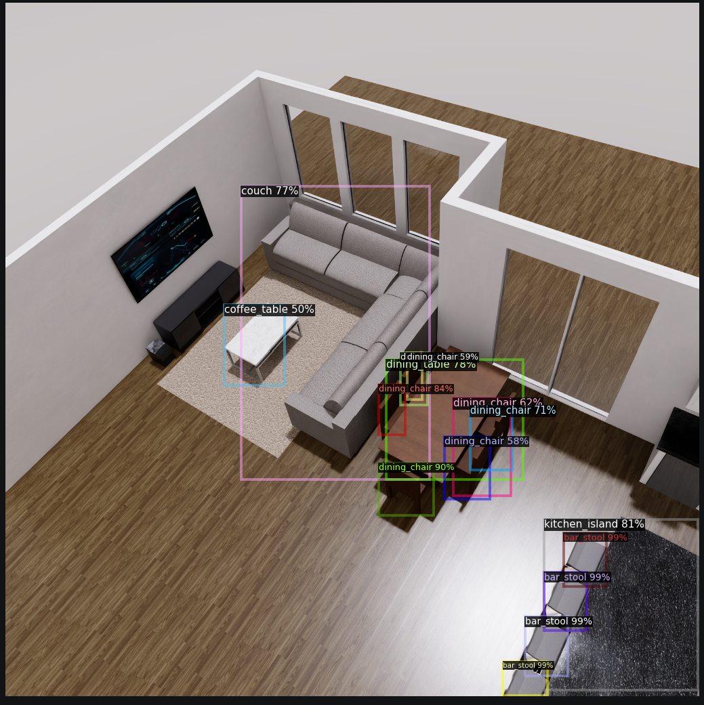
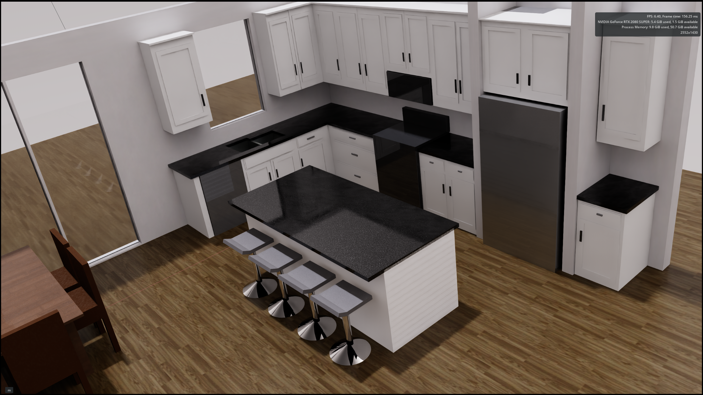

# 🧠 Simulation-to-Detection Pipeline (Project 12)

### Computer Vision Detection Result
Visual of objects detected within the digital twin environment. 


An end-to-end computer vision pipeline built using **NVIDIA Omniverse Replicator** and **Detectron2**, demonstrating synthetic data generation, annotation cleaning, and object detection training.

---

## 🎯 Project Goal

Build a full pipeline that:

1. Generates synthetic data from a digital twin environment
2. Cleans noisy USD-based annotations
3. Converts data to COCO format
4. Trains a deep learning object detection model
5. Validates results with inference visualizations

---

## 🏗️ Environment (Digital Twin Scene)

The dataset was generated from a custom-built Omniverse environment:

### 1. Full View
Visual of full room view within the digital twin environment. 


### 2. Left View
Visual of left side of room within the digital twin environment. 


### 3. Right View
Visual of right side of room within the digital twin environment. 


Scenes include:

* Living room (couch, TV, coffee table)
* Dining area (table + chairs)
* Kitchen (island + bar stools + appliances)

---

## 📸 Inference Results

Model predictions on validation images:


✔ Tight bounding boxes
✔ Strong multi-object detection
✔ Clear class separation

---

## 📊 Results

| Metric                 | Value    |
| ---------------------- | -------- |
| AP (Average Precision) | **67.0** |
| AP50                   | **99.1** |
| AP75                   | **61.3** |

### Per-Class Performance

* kitchen_island: 90.7
* bar_stool: 90.3
* tv: 80.1
* couch: 57.4
* coffee_table: 50.4
* dining_table: 50.1
* dining_chair: 49.6

---

## 🔍 Key Engineering Insight

Raw synthetic annotations contained **mesh-level noise** due to deep USD hierarchies.

To fix this:

* Filtered bounding boxes using **prim path validation**
* Kept only object-level paths (e.g., `/Environment/object`)
* Removed geometry-level entries (Cube, Cylinder, etc.)

➡️ Result: Clean dataset → stable training → strong detection

---

## 🧱 Pipeline Overview

```
Omniverse Replicator
        ↓
Raw Synthetic Data (RGB + bbox + labels)
        ↓
Annotation Filtering (USD-aware)
        ↓
COCO Conversion
        ↓
Train/Val Split
        ↓
Detectron2 Training (Faster R-CNN)
        ↓
Inference + Visualization
```

---

## 🛠️ Tools Used

* NVIDIA Omniverse (USD / Replicator)
* Python
* NumPy
* Detectron2 (PyTorch)
* OpenCV

---

## 🚀 What This Demonstrates

* Synthetic data generation for computer vision
* OpenUSD pipeline understanding
* Annotation debugging at scale
* COCO dataset construction
* Deep learning training and evaluation
* Real-world CV problem solving

---

## ⚠️ Known Limitations

* Lower recall on thin / low-contrast objects (e.g., TV)
* Dataset size limited (40 images)
* No augmentation applied (baseline training)

---

## 📌 Future Work

* Increase dataset size (domain randomization)
* Improve class balance
* Multi-camera training
* Temporal (video) inference

---

## 📎 Repository Structure

```
data/
images/
output/
src/
```

---

## 👤 Author

Dartayous Hunter
Digital Twin + Computer Vision Engineering
